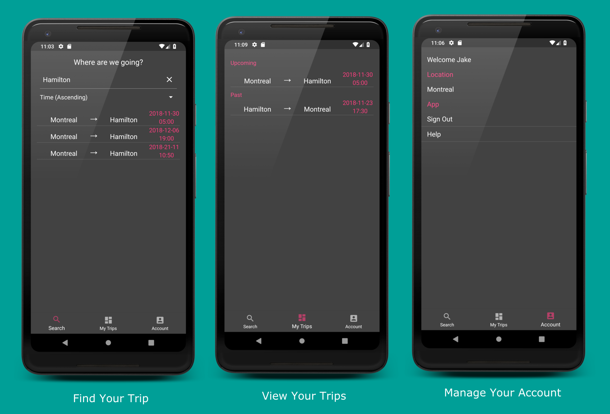
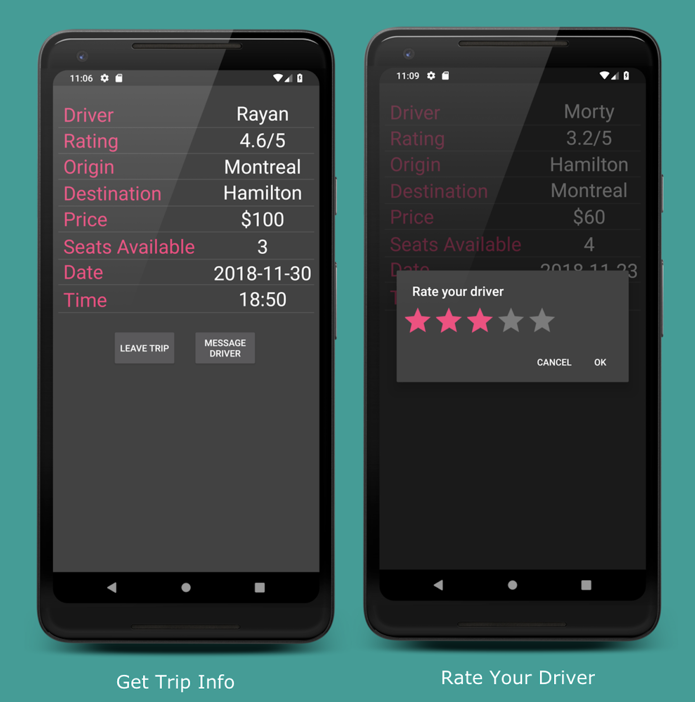
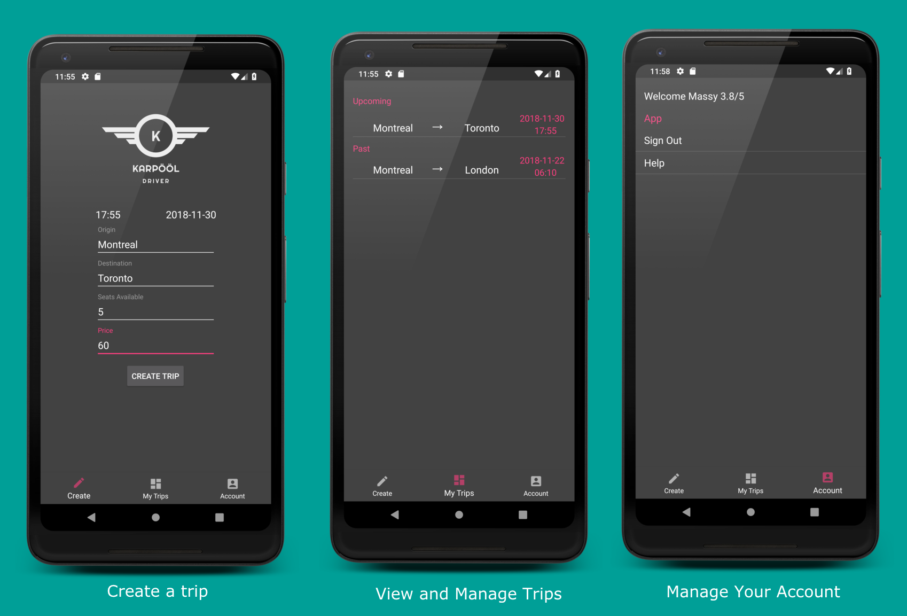

# KARPÖÖL 
 

# Overview

KARPOOL is a software system that was created to help drivers and passengers who are travelling on
similar/identical intercity routes within North America.

**[Click here to visit our app!](https://karpool-spring-14.herokuapp.com/)** 

# Requirements

### Mobile Frontend
* This is separated into two apps: one for drivers and one for passengers.
* Drivers can advertise trips to passengers
* Both the driver and passenger can contact each-other through an in-app text button
* Trips will include the destination, departure date and time, price, available seats and the driver rating.
* Passengers can search for trips and sort them in terms of ascending date or lowest price
* Passengers can rate their driver once a trip is complete

#### Passenger App

The passenger app provides a sleek, and simple user experience with an initial view of the search trip fragment. Passengers can view both their upcoming and past trips. They also have the ability to leave a trip in-case they change their mind. Once a trip is complete, they can rate their driver.  The account menu provides the user with the ability to set their location, which is required to search for a trip. They can also sign out or view the help documentation.

#### Driver App

The driver app takes app the same general aesthetic of the passenger app except the user is initially greeted with a create trip page. Drivers have the ability to view their past and upcoming trips as well as make contact with their passengers. They can also modify a trip if a passenger has not already joined. A driver reserves the right to delete a trip before it occurrs however, does not have this option on the day of the trip. After the trip, the driver may close the trip to indicate it as complete. The account menu allows the driver to view his/her rating as well as view the help documentation or sign out.

### Web Frontend

**[Click here to visit the web repository](https://github.com/ECSE321-Fall2018/t14-web)**

* System administrators can gain an overview of the ride sharing network
* Include a means of checking the status of all active drivers and passengers in the
network and listing top drivers and passengers based on historical data

### Backend
* RESTful web service
* Persistence layer
* Unit tests
* Build system
* CI process specification
* [Project backlog](https://github.com/ECSE321-Fall2018/t14/issues?q=is%3Aissue+is%3Aclosed)
